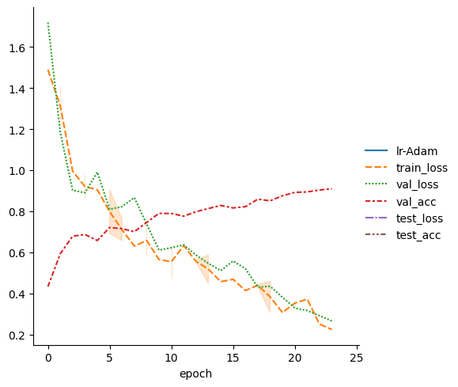
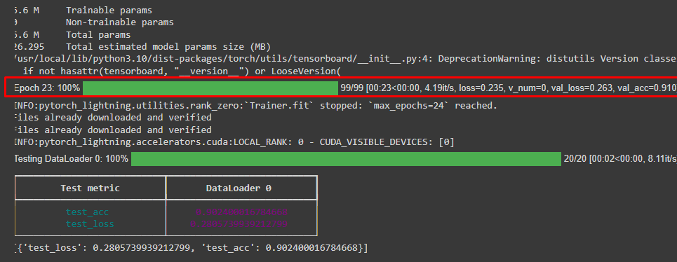
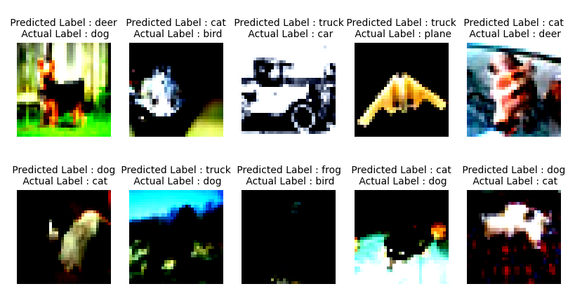

# PyTorch Lightning - Cifar10 Classification

## Model

### Image Augmentation applied
```
train_transforms = torchvision.transforms.Compose(
    [
        torchvision.transforms.RandomCrop(32, padding=4),
        torchvision.transforms.RandomHorizontalFlip(),
        torchvision.transforms.ToTensor(),
        cifar10_normalization(),
    ]
)
```

### OneCycle LR scheduler

```
def configure_optimizers(self):
        optimizer = torch.optim.Adam(
            self.parameters(),
            lr=self.hparams.lr,

            weight_decay=5e-4,
        )
        steps_per_epoch = 45000 // BATCH_SIZE
        scheduler_dict = {
            "scheduler": OneCycleLR(
                optimizer,
                0.01,
                epochs=self.trainer.max_epochs,
                steps_per_epoch=steps_per_epoch,
            ),
            "interval": "step",
        }
        return {"optimizer": optimizer, "lr_scheduler": scheduler_dict}
```


## Logs and Graphs



**Full Logs found at: https://tensorboard.dev/experiment/8nney0XgQIagnXtd36XFrQ/#scalars**

### Test Accuracy achieved in 24 epochs - 90.3%




## Misclassified Images




## Huggingface Link
https://huggingface.co/spaces/sushant097/ERA-V1-GradCam-Cifar10-Demo
