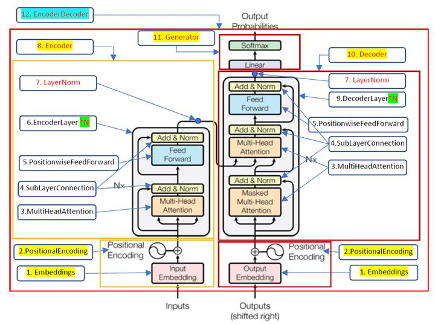
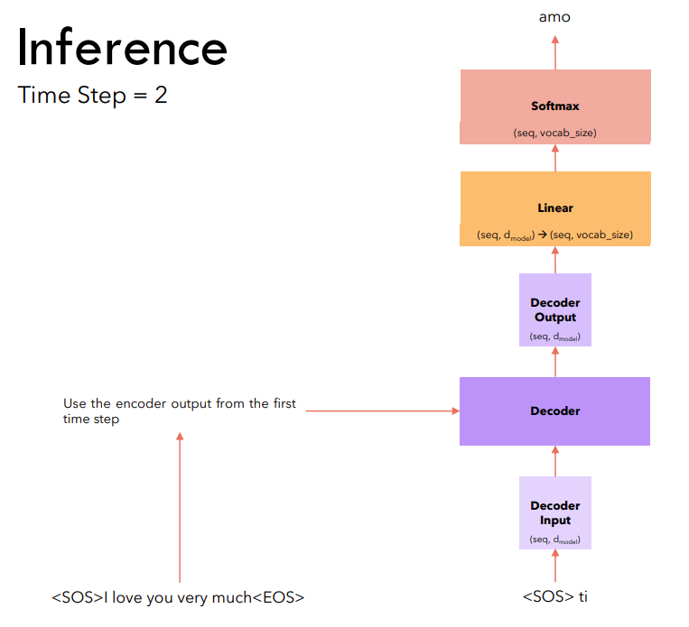
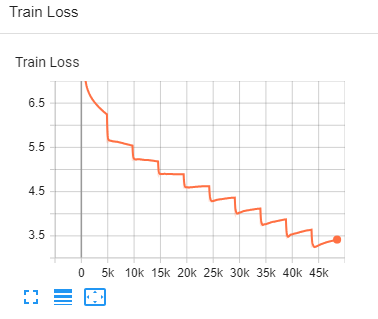
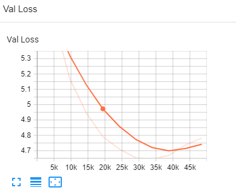

# ERA - V1

## Session 15 - Dawn of Transformers - Part II Part A & B

<br>

# Assignment

1. Rewrite the whole code covered in the class in Pytorch-Lightning (code copy will not be provided)
2. Train the model for 10 epochs
3. Achieve a loss of less than 4

<br>

# Objective

* The objective of this assignment:

1. Understand the working of the transforms in depth
2. Train it properly so that loss should start from 9 and reduce up to 4 that validate that your code is working. 

<br>

# Architecture



<br>

# Dataset

The Dataset used here is the `Opus Dataset` from `Hugging Face` Datasets

Link - [Dataset](https://huggingface.co/datasets/opus_books)

* Source Language : `English`
* Target Language : `Italian`

<br>

```python
Max length of source sentence: 309
Max length of target sentence: 274
Source Tokenizer Vocab Size : 15698
Target Tokenizer Vocab Size : 22463
```

#  Inference:


<br>

# Metrics Used

## Char Error Rate (CER)

* Character Error Rate (CER) is a metric of the performance of an automatic speech recognition (ASR) system.

* This value indicates the percentage of characters that were incorrectly predicted. The lower the value, the better the performance of the ASR system with a CharErrorRate of 0 being a perfect score. Character error rate can then be computed as: 


## Word Error Rate

* Word error rate (WordErrorRate) is a common metric of the performance of an automatic speech recognition.

* This value indicates the percentage of words that were incorrectly predicted. The lower the value, the better the performance of the ASR system with a WER of 0 being a perfect score. Word error rate can then be computed as:


## BLEU Score

Calculate BLEU score of machine translated text with one or more references.

* As input to forward and update the metric accepts the following input:

    preds (Sequence): An iterable of machine translated corpus

    target (Sequence): An iterable of iterables of reference corpus

As output of forward and update the metric returns the following output:

* bleu (Tensor): A tensor with the BLEU Score

<br>

# Model Summary

```python
  | Name            | Type             | Params
-----------------------------------------------------
0 | net             | Transformer      | 75.1 M
1 | loss_fn         | CrossEntropyLoss | 0     
2 | char_error_rate | _CharErrorRate   | 0     
3 | word_error_rate | _WordErrorRate   | 0     
4 | bleu_score      | _BLEUScore       | 0     
-----------------------------------------------------
75.1 M    Trainable params
0         Non-trainable params
75.1 M    Total params
300.532   Total estimated model params size (MB)
```

<br>


# Results

<br>

```python
Epoch : 9
Training Loss : 3.418180
Validation Loss : 4.764558
----------------------------------------------------------------------
SOURCE    => ['By clinging like grim death to the gunwale, we just managed to keep inside the boat, but it was exhausting work.']
Ground Truth  => ['Con l’abbrancarci disperatamente al capo di banda riuscimmo a tenerci al di dentro della barca, ma lo sforzo ci prostrò.']
PREDICTED => A proposito di furore la morte di noi stessi in tal punto la barca , ma la barca era a contro la barca .
----------------------------------------------------------------------
Validation CER  => 0.699999988079071
Validation WER  => 1.149999976158142
Validation BLEU => 0.0
----------------------------------------------------------------------
```

<br>

# Training Logs - [Link](training_logs.md)

**Training loss**



**Validation Loss**



## Full Logs [graphical] - Tensorboard Dev: https://tensorboard.dev/experiment/dJVljQCOSOeUwwF5EHgNVQ/ 
