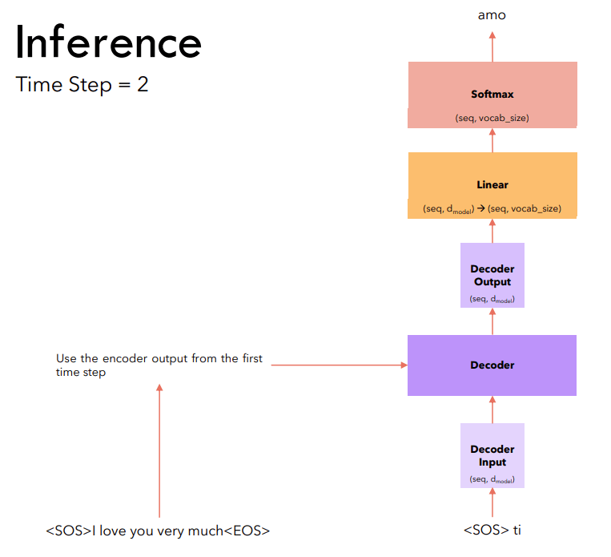

# ERA - V1

## Session 16 - Transformer Architectures and Speeding therm up!

<br>

# Assignment

1. Pick the "en-fr" dataset from opus_books
2. Remove all English sentences with more than 150 "tokens"
3. Remove all french sentences where len(fench_sentences) > len(english_sentrnce) + 10
4. Train your own transformer (E-D) (do anything you want, use PyTorch, OCP, PS, AMP, etc), but get your loss under 1.8

<br>

# Objective

* The objective of this assignment:

1. Understand the working of the transforms in depth
2. Train it properly so that loss should start from 9 and reduce up to 4 that validate that your code is working. 

<br>

# Architecture


<br>

# Dataset

The Dataset used here is the `Opus Dataset` from `Hugging Face` Datasets

Link - [Dataset](https://huggingface.co/datasets/opus_books)

* Source Language : `English`
* Target Language : `French`

<br>

```python
Length of filtered dataset: 120677
Train Dataset size: 108609
Validation Dataset Size: 12068
Max length of source sentence: 150
Max length of target sentence: 159
Source Tokenizer Vocab Size : 30000
Target Tokenizer Vocab Size : 30000
```

#  Inference:


<br>

# Metrics Used

## Char Error Rate (CER)

* Character Error Rate (CER) is a metric of the performance of an automatic speech recognition (ASR) system.

* This value indicates the percentage of characters that were incorrectly predicted. The lower the value, the better the performance of the ASR system with a CharErrorRate of 0 being a perfect score. Character error rate can then be computed as: 


## Word Error Rate

* Word error rate (WordErrorRate) is a common metric of the performance of an automatic speech recognition.

* This value indicates the percentage of words that were incorrectly predicted. The lower the value, the better the performance of the ASR system with a WER of 0 being a perfect score. Word error rate can then be computed as:


## BLEU Score

Calculate BLEU score of machine translated text with one or more references.

* As input to forward and update the metric accepts the following input:

    preds (Sequence): An iterable of machine translated corpus

    target (Sequence): An iterable of iterables of reference corpus

As output of forward and update the metric returns the following output:

* bleu (Tensor): A tensor with the BLEU Score

<br>

# Model Summary

```python
  | Name            | Type             | Params
-----------------------------------------------------
0 | net             | Transformer      | 75.1 M
1 | loss_fn         | CrossEntropyLoss | 0     
2 | char_error_rate | _CharErrorRate   | 0     
3 | word_error_rate | _WordErrorRate   | 0     
4 | bleu_score      | _BLEUScore       | 0     
-----------------------------------------------------
75.1 M    Trainable params
0         Non-trainable params
75.1 M    Total params
300.532   Total estimated model params size (MB)
```

<br>


# Results

<br>

```python
Epoch : 25
----------------------------------------------------------------------
SOURCE    => ["Such was the succession of phenomena which produced Iceland, all arising from the action of internal fire; and to suppose that the mass within did not still exist in a state of liquid incandescence was absurd; and nothing could surpass the absurdity of fancying that it was possible to reach the earth's centre."]
Ground Truth  => ["Telle fut la succession des phénomènes qui constituèrent l'Islande; tous provenaient de l'action des feux intérieurs, et supposer que la masse interne ne demeurait pas dans un état permanent d'incandescente liquidité, c'était folie. Folie surtout de prétendre atteindre le centre du globe!"]
PREDICTED => Telle fut la succession des phénomènes qui produisaient l ' Islande , tout le coup de feu intérieure ; et , pour supposer que la masse intérieure n ' existait pas encore dans un état de liquide , rien ne pouvait faire soupçonner l ' existence des terrains qu ' il était possible d ' atteindre au centre .
----------------------------------------------------------------------
Validation CER  => 0.5224913358688354
Validation WER  => 1.0
Validation BLEU => 0.0
----------------------------------------------------------------------
Training Loss   :  1.7259
----------------------------------------------------------------------
Validation: 0it [00:00, ?it/s]
Epoch : 26
----------------------------------------------------------------------
SOURCE    => ["Such was the succession of phenomena which produced Iceland, all arising from the action of internal fire; and to suppose that the mass within did not still exist in a state of liquid incandescence was absurd; and nothing could surpass the absurdity of fancying that it was possible to reach the earth's centre."]
Ground Truth  => ["Telle fut la succession des phénomènes qui constituèrent l'Islande; tous provenaient de l'action des feux intérieurs, et supposer que la masse interne ne demeurait pas dans un état permanent d'incandescente liquidité, c'était folie. Folie surtout de prétendre atteindre le centre du globe!"]
PREDICTED => Telle fut la succession de phénomènes qui , toute action dans l ' intérieur du feu , et supposer que le massif n ' existait pas encore dans un état de liquide , et rien ne pouvait faire soupçonner l ' existence des choses telles qu ' il était possible d ' atteindre au centre de la terre .
----------------------------------------------------------------------
Validation CER  => 0.5882353186607361
Validation WER  => 1.047619104385376
Validation BLEU => 0.0
----------------------------------------------------------------------
Training Loss   :  1.71871
----------------------------------------------------------------------
Validation: 0it [00:00, ?it/s]
Epoch : 27
----------------------------------------------------------------------
SOURCE    => ["Such was the succession of phenomena which produced Iceland, all arising from the action of internal fire; and to suppose that the mass within did not still exist in a state of liquid incandescence was absurd; and nothing could surpass the absurdity of fancying that it was possible to reach the earth's centre."]
Ground Truth  => ["Telle fut la succession des phénomènes qui constituèrent l'Islande; tous provenaient de l'action des feux intérieurs, et supposer que la masse interne ne demeurait pas dans un état permanent d'incandescente liquidité, c'était folie. Folie surtout de prétendre atteindre le centre du globe!"]
PREDICTED => Telle fut la succession des phénomènes qui s ' échappaient , toute dans l ' action du feu , et supposer que la masse intérieure n ' existait pas encore dans un état de liquide , rien ne pouvait faire l ' idée de s ' emparer du centre .
----------------------------------------------------------------------
Validation CER  => 0.49480968713760376
Validation WER  => 0.7857142686843872
Validation BLEU => 0.0
----------------------------------------------------------------------
Training Loss   :  1.71201
----------------------------------------------------------------------
Validation: 0it [00:00, ?it/s]
Epoch : 28
----------------------------------------------------------------------
SOURCE    => ["Such was the succession of phenomena which produced Iceland, all arising from the action of internal fire; and to suppose that the mass within did not still exist in a state of liquid incandescence was absurd; and nothing could surpass the absurdity of fancying that it was possible to reach the earth's centre."]
Ground Truth  => ["Telle fut la succession des phénomènes qui constituèrent l'Islande; tous provenaient de l'action des feux intérieurs, et supposer que la masse interne ne demeurait pas dans un état permanent d'incandescente liquidité, c'était folie. Folie surtout de prétendre atteindre le centre du globe!"]
PREDICTED => Telle fut la succession des phénomènes qui s ' frere , toute marque des feux intérieurs ; et supposer que la masse ci n ' existait pas encore dans un état de liquide , et rien ne pouvait faire la situation qu ' il était possible d ' atteindre le centre de la terre .
----------------------------------------------------------------------
Validation CER  => 0.47058823704719543
Validation WER  => 0.8095238208770752
Validation BLEU => 0.0
----------------------------------------------------------------------
Training Loss   :  1.70668
----------------------------------------------------------------------
Validation: 0it [00:00, ?it/s]
Epoch : 29
----------------------------------------------------------------------
SOURCE    => ["Such was the succession of phenomena which produced Iceland, all arising from the action of internal fire; and to suppose that the mass within did not still exist in a state of liquid incandescence was absurd; and nothing could surpass the absurdity of fancying that it was possible to reach the earth's centre."]
Ground Truth  => ["Telle fut la succession des phénomènes qui constituèrent l'Islande; tous provenaient de l'action des feux intérieurs, et supposer que la masse interne ne demeurait pas dans un état permanent d'incandescente liquidité, c'était folie. Folie surtout de prétendre atteindre le centre du globe!"]
PREDICTED => Telle fut la succession de phénomènes qui , toute action dans l ' intérieur du feu , et supposer que la masse intérieure n ' existait pas encore dans un état de liquide , et rien ne pouvait faire l ' idée qu ' elle était possible d ' atteindre le centre de la terre .
----------------------------------------------------------------------
Validation CER  => 0.5051903128623962
Validation WER  => 0.9047619104385376
Validation BLEU => 0.0
----------------------------------------------------------------------
Training Loss   :  1.70244
----------------------------------------------------------------------
```

<br>

# Training Logs - [Link](training_logs.md)

**Training loss**


## Full Logs [graphical] - Tensorboard Dev: https://tensorboard.dev/experiment/Paa9YWzKQXGy2uYvB2KFAA/#scalars
