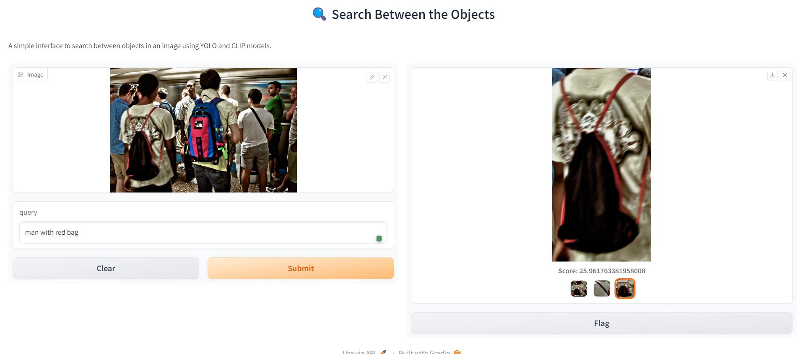

# Gradio demo for search between the objects

Search between the objects in an image, and cut the region of the detected object.

## About this project
CLIP model was proposed by the OpenAI company, to understand the semantic similarity between images and texts. It's used for preform zero-shot learning tasks, to find objects in an image based on an input query. CLIP, which stands for "Contrastive Language-Image Pre-training," is a state-of-the-art machine learning model developed by OpenAI. It's designed to understand and connect images and text in a way that enables a wide range of applications, from image and text classification to generating textual descriptions for images. It was introduced by OpenAI in early 2021 and has garnered significant attention due to its impressive performance in various tasks.

CLIP pre-trains an image encoder and a text encoder to predict which images were paired with which texts in our dataset. We then use this behavior to turn CLIP into a zero-shot classifier. We convert all of a dataset’s classes into captions such as “a photo of a dog” and predict the class of the caption CLIP estimates best pairs with a given image.

Also, YOLOv5 was used in the first step of the method, to detect the location of the objects in an image.

## Demo

HuggingFace Gradio App [Live Demo]: https://huggingface.co/spaces/sushant097/SearchBetweenObjects