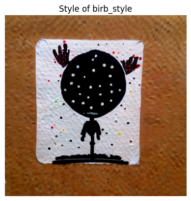
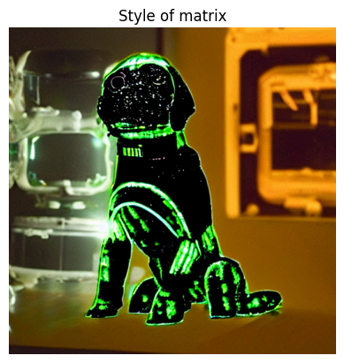
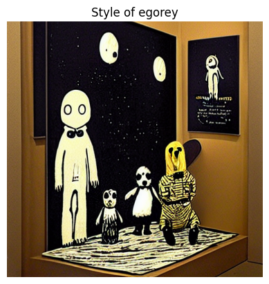
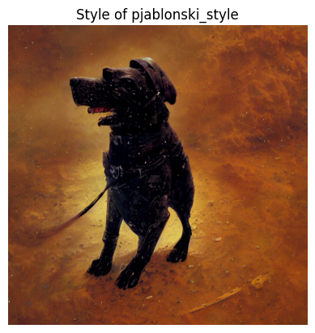
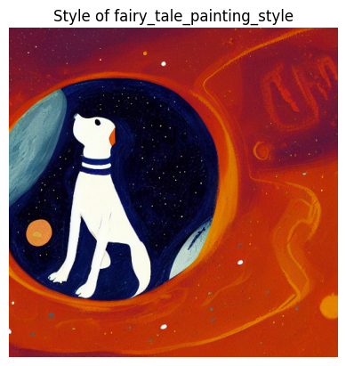
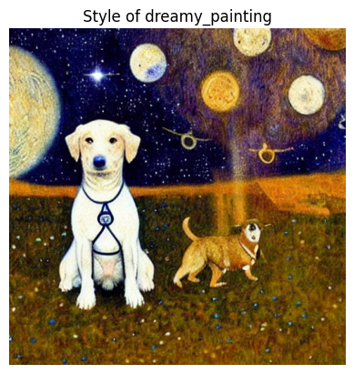
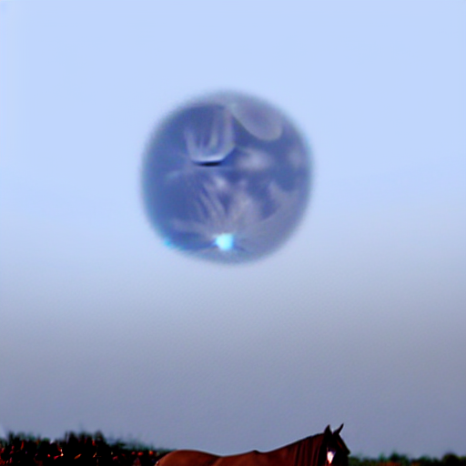
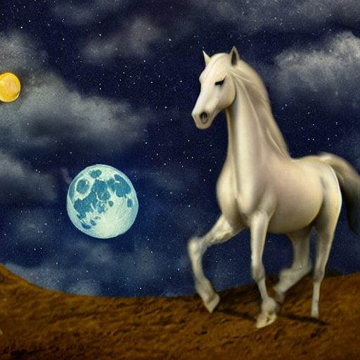

# Session 20

**Hugging Face Demo**: 

**Prompt: a dog as a astronaut**

**Bird Style**



**Matrix Style**



**Egorey Style**




**Pjablonski Style**




**Fairy tale painting Style**




**Dreamy Painting Style**




### Blue Loss
```python
def blue_loss(images):
    # How far are the blue channel values to 0.9:
    error = torch.abs(images[:,2] - 0.7).mean() # [:,2] -> all images in batch, only the blue channel
    return error
```
**output:**



### Custom Loss
```python
def custom_loss(image):
    # Calculate colorfulness metric (standard deviation of RGB channels)
    std_dev = torch.std(image, dim=(1, 2))
    loss = torch.mean(std_dev)
    return loss
```

**output:**



