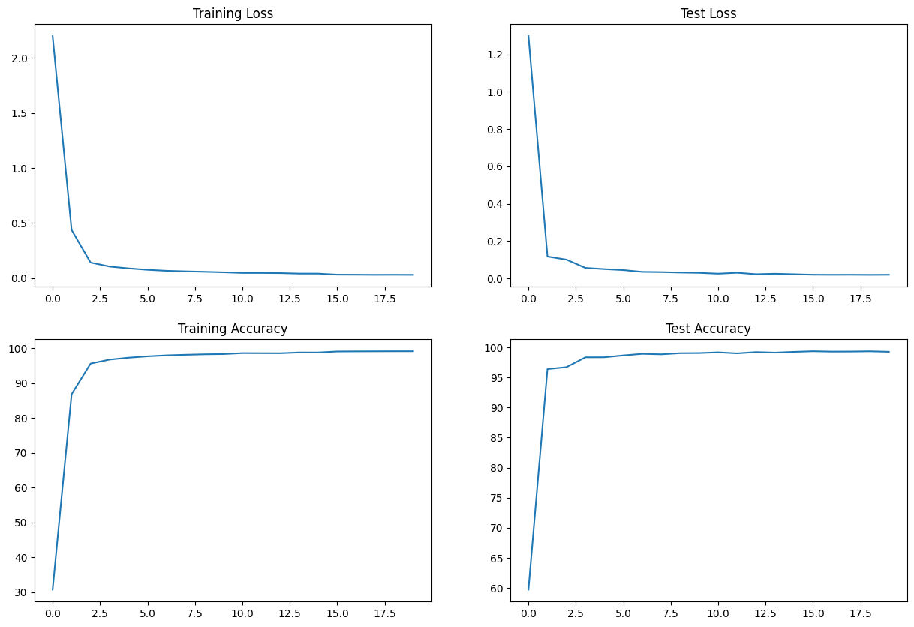

# Session 5: Introduction to PyTorch
## Introduction:
Here in this session we learn about PyTorch, basic concepts of PyTorch Tensor, Implemented a toy Neural Network to train on MNIST dataset.


## Objective
* Correct the error prone code in each block
* Refactor/modularize code into `model.py` and `utils.py`

From this I learned about the modular decomposition of code and train the network properly.

### Files Details:
```
Session5
|--model.py
|--utils.py
|--S5.ipynb
|--README.md
|--images
|  |--losses.png
   |

```
* `model.py`: Where the model architecture code is kept.
* `utils.py`: All necessary helpful functions and code like data download, transform, train and test logic etc. is kept.
* `S5.ipynb`: Jupyter Notebook file where main training on the given epochs is done and all others necessary modules of `utils.py` and `model.py` is called in main loop.

### Model Architecture details:
The simple model used for MNIST classification have 6 layers and code to generate summary and summary is shown below:

```python
from torchsummary import summary
use_cuda = torch.cuda.is_available()
device = torch.device("cuda" if use_cuda else "cpu")
model = Net().to(device)
summary(model, input_size=(1, 28, 28))
```

**Model Summary**

```
----------------------------------------------------------------
        Layer (type)               Output Shape         Param #
================================================================
            Conv2d-1           [-1, 32, 26, 26]             320
            Conv2d-2           [-1, 64, 24, 24]          18,496
            Conv2d-3          [-1, 128, 10, 10]          73,856
            Conv2d-4            [-1, 256, 8, 8]         295,168
            Linear-5                   [-1, 50]         204,850
            Linear-6                   [-1, 10]             510
================================================================
Total params: 593,200
Trainable params: 593,200
Non-trainable params: 0
----------------------------------------------------------------
Input size (MB): 0.00
Forward/backward pass size (MB): 0.67
Params size (MB): 2.26
Estimated Total Size (MB): 2.94
----------------------------------------------------------------
```

## Training details:
**Hyperparameters I used**
* Optimizer: `Adam` with `learning_rate`=0.01 and `momentum`=0.9.
* Scheduler: `StepLR` scheduler is used when in every 15 epoch it decrease the `learning_rate` with factor 0.1.
* Epochs: 20
* Batch_size: 512

### Training Results:
**Loss/Accuracy Graph**
