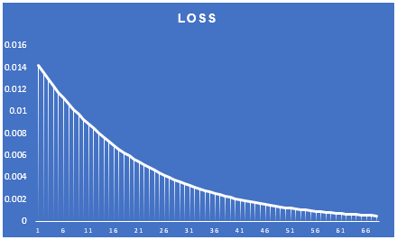

# Assignment 6 Part 1 
# Part 1
## Manual Backpropagation for a Three layer (1 Input, 1 Hidden and 1 Output layer) Neural Network usingdifferent learning rates
### Neural Network Architecture

## Input Nodes:
* i1
* i2

## Target nodes :
* t1
* t2

## Hidden Layer Nodes:
- h1 = w1*i1 + w2*i2
- h2 = w3*i1 + w4*i2

### Activation values for Hidden Layer (Sigmoid):
a_h1 = σ(h1) = $\frac{1}{1 + \exp{-h1}}$
a_h2 = σ(h2) = $\frac{1}{1 + \exp{-h2}}$

## Output Layer Nodes:
```math
o1 = w5*a_{h1} + w6*a_{h2}
```

```math
o2 = w7*a_{h1}+ w8*a_{h2}
```

### Activation values for Output Layer (Sigmoid):
$a_{o1} = σ(o1) = \dfrac{1}{1 + \exp{-o1}}$


$a_{o2} = σ(o2) = \dfrac{1}{1 + \exp{-o2}}$

## Error Calculations (Loss Function):
$E1 = \dfrac{1}{2} * (t1 - a_{o1})^2$

$E2 = \dfrac{1}{2} * (t2 - a_{o2})^2$

$E_{Total} = E1 + E2$
## Backpropagation to minimize Loss function E_Total

### Gradient of $E_{Total}$ calculated with respect to all the weights (parameters) w1, w2, w3, w4, w5,w6, w7, w8 using Partial Derivatives

$\frac{∂E_{total}}{∂w5} = \frac{∂(E1+E2)}{∂w5}$

**And E2 is constant w.r.t w5 thus only E1 remains**

$\frac{∂E_{total}}{∂w5} = \frac{∂E1}{∂w5} $

**Applying Chain Rule**

$\frac{∂E_{total}}{∂w5} = \frac{∂E1}{∂w5} = \frac{∂E1}{∂a_{o1}}  * \frac{∂a_{o1}}{∂o1} * \frac {∂o1}{∂w5} $

```math
\frac{∂E1}{∂a_{o1}} = \dfrac{\dfrac{1}{2} * ∂ (t1 - a_{o1})^2}{∂a_o1} = \frac{1}{2}*2*(t1-a_{01}) * (-1) =- (t1 - a_{o1})=(a_{o1} - t1)
```

```math
\dfrac{∂a_{o1}}{∂o1} = \dfrac{∂(σ(o1))}{∂o1} = σ(o1)*(1 - σ(o1)) =a_{o1} * (1 - a_{o1}) : [Sincederivative of σ(x) = σ(x)*(1-σ(x))]
```

Hence,

$\dfrac{∂E_{total}}{∂w5} = (a_{01} - t1) * a_{o1} * (1 - a_{o1}) * a_{h1} $

Similar calculations done for weights w6, w7 & w8.

$\dfrac{∂E_{total}}{∂w6} = (a_{01} - t1) * a_{o1} * (1 - a_{o1}) * a_{h2} $

$\dfrac{∂E_{total}}{∂w7} = (a_{02} - t2) * a_{o2} * (1 - a_{o2}) * a_{h1} $

$\dfrac{∂E_{total}}{∂w8} = (a_{02} - t2) * a_{o2} * (1 - a_{o2}) * a_{h2} $

### $a_{h1}$ is connected to two output nodes in the next layer hence E_Total is:
$\dfrac{∂E_{total}}{∂a_{h1}} = \frac{∂E1}{∂a_{h1}} + \frac{∂E2}{∂a_{h1}}$

∂E1/∂a_h1 can be represented as below with subsequent steps:

∂E1/∂a_h1 = ∂E1/∂a_o1 * ∂a_o1/∂o1 * ∂o1/∂a_h1
∂E1/∂a_h1 = (a_o1 - t1) * a_o1 * (1 - a_o1) * w5

Similarly ∂E2/∂a_h1 can be written as:

∂E2/∂a_h1 = (a_o2 - t2) * a_o2 * (1 - a_o2) * w7
∂E_total/∂a_h1 is now:

∂E_total/∂a_h1 = (a_o1 - t1) * a_o1 * (1 - a_o1) * w5 + (a_o2 - t2) * a_o2 * (1 - a_o2) * w7

Similar calculation is done for ∂E_total/∂a_h2:

∂E_total/∂a_h2 = (a_o1 - t1) * a_o1 * (1 - a_o1) * w6 + (a_o2 - t2) * a_o2 * (1 - a_o2) * w8

**Gradient for w1 is represented as below:**

∂E_total/∂w1 = ∂E_total/∂a_h1 * ∂a_h1/∂h1 * ∂h1/∂w1

∂E_total/∂a_h1 is already calculated above.

∂a_h1/∂h1 is sigmoid differential
∂h1/∂w1 is equal to i1

Overall the equation for ∂E_total/∂w1 can be represented as:

∂E_total/∂w1 = ((a_o1 - t1) * a_o1 * (1 - a_o1) * w5 + (a_o2 - t2) * a_o2 * (1 - a_o2) * w7) * ( a_h1 * (1- a_h1) ) * i1

Similar calculations can be performed on w2, w3 and w4. Following are their gradient respectively

∂E_total/∂w2 = ((a_o1 - t1) * a_o1 * (1 - a_o1) * w5 + (a_o2 - t2) * a_o2 * (1 - a_o2) * w7) * ( a_h1 * (1- a_h1) ) * i2

∂E_total/∂w3 = ((a_o1 - t1) * a_o1 * (1 - a_o1) * w6 + (a_o2 - t2) * a_o2 * (1 - a_o2) * w8) * ( a_h2 * (1- a_h2) ) * i1

∂E_total/∂w4 = ((a_o1 - t1) * a_o1 * (1 - a_o1) * w6 + (a_o2 - t2) * a_o2 * (1 - a_o2) * w8) * ( a_h2 * (1- a_h2) ) * i2

### We have gradient values of all, then backpropagation starts. Weights are updated with these gradientsand controlled the how fast its updated by learning rate. 

For Example, The first parameter w1, updated w1 will be  with gradient descent is: 

$( w1 - LR * \frac{∂E_{total}}{∂w1})$

We analyse the Loss over **100 iterations**, for different learning rates and understand its impact onnetwork convergence.


## Learning rate 0.1:


## Learning rate 0.2:


## Learning rate 0.5:


## Learning rate 0.8:



## Learning rate 1.0


## Learning rate 2.0:
