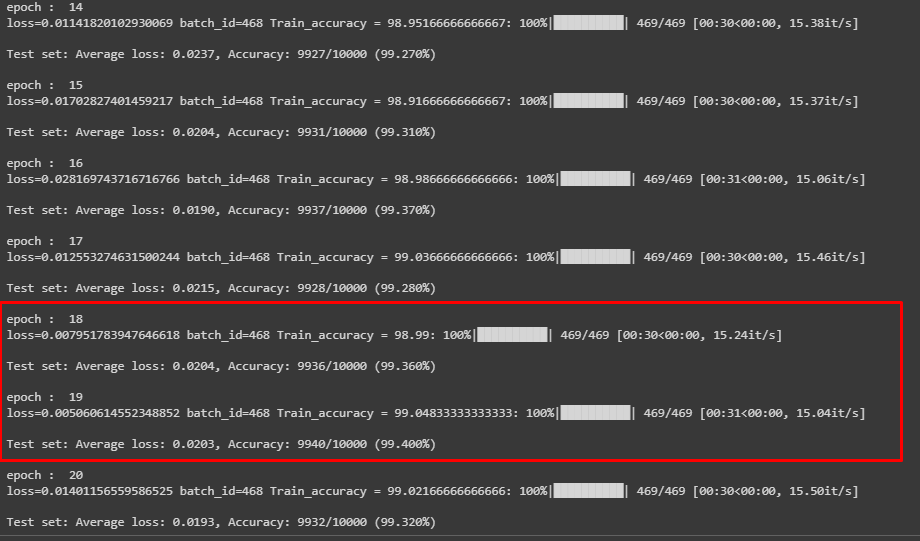

# Part 2

## MNIST CLassifier using Convolutional Neural Network with 99.4% Validation accuracy and parameters less than 20K.

### Constraints :

1.Numnber of parameters < 20K

2.Less than 20 epochs

### Network Summary

```
----------------------------------------------------------------
        Layer (type)               Output Shape         Param #
================================================================
            Conv2d-1            [-1, 8, 26, 26]              80
       BatchNorm2d-2            [-1, 8, 26, 26]              16
           Dropout-3            [-1, 8, 26, 26]               0
            Conv2d-4           [-1, 32, 24, 24]           2,336
       BatchNorm2d-5           [-1, 32, 24, 24]              64
           Dropout-6           [-1, 32, 24, 24]               0
            Conv2d-7            [-1, 8, 24, 24]             264
         MaxPool2d-8            [-1, 8, 12, 12]               0
            Conv2d-9           [-1, 32, 10, 10]           2,336
      BatchNorm2d-10           [-1, 32, 10, 10]              64
          Dropout-11           [-1, 32, 10, 10]               0
           Conv2d-12             [-1, 32, 8, 8]           9,248
      BatchNorm2d-13             [-1, 32, 8, 8]              64
          Dropout-14             [-1, 32, 8, 8]               0
           Conv2d-15             [-1, 16, 8, 8]             528
        MaxPool2d-16             [-1, 16, 4, 4]               0
           Conv2d-17             [-1, 32, 2, 2]           4,640
        AvgPool2d-18             [-1, 32, 1, 1]               0
           Linear-19                   [-1, 10]             330
================================================================
Total params: 19,970
Trainable params: 19,970
Non-trainable params: 0
----------------------------------------------------------------
Input size (MB): 0.00
Forward/backward pass size (MB): 0.72
Params size (MB): 0.08
Estimated Total Size (MB): 0.80
----------------------------------------------------------------
```

**Major points of this Squeeze and Excite Network Architecture:**

* Network has total 9 layers.

* Fundamental block used for designing layers is  `Convolution-Relu-Batch Normalization`.

* Dropout of 0.05% is used after Batch Normalization layer. This is MNIST, seems like greater dropout makes harder to get test accuracy within the constraint i.e. 99.4%

* Dropout & Batch Normalization not used after 1x1 convolution layer as observed that there should be some gap to get good test results. 

* 1x1 convolution is used after two 3x3 convolutions followed by Max pooling.

* GAP is used near to last layer after convolution and a layer before fully connected layer.


* Leakly Relu with negative slope = 0.01 helps to recover died neurons and helps to get higher test accuracy within less epochs in compare to Relu which removed negative neurons. But can't get 99.4% accuracy with that within 20 epochs for MNIST dataset. 


* Number of channels vary from 8 to 32 at different layers. Also 64, 128 channels is tried but this only increased number of parameters but test accuracy is harder to get as desired. 

* Log Softmax used as last layer activation (for multi-class ) function with NLL Loss. 

* Fully connected (FC) layer is the last layer of network.

* Trainable parameters for network are 19,970 (less than 20k).

## 99.4% test/validation accuracy from 14th epoch and maximum test accuracy got is 99.430%.




