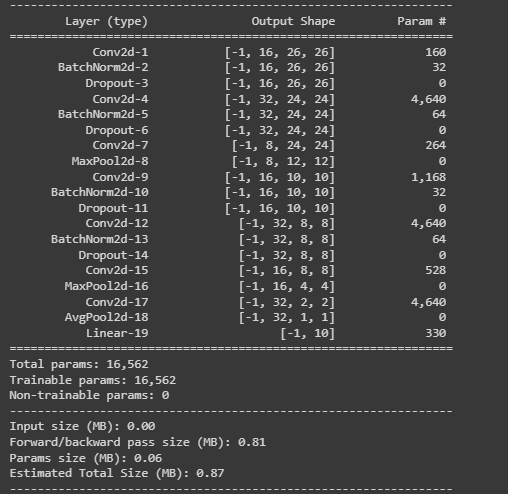
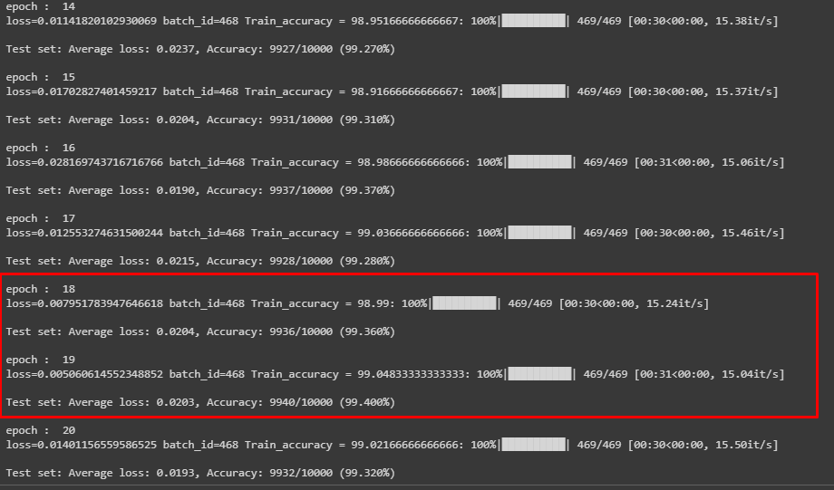

# Part 2

## MNIST CLassifier using Convolutional Neural Network with 99.4% Validation accuracy

### Constraints :

1.Numnber of parameters < 20K

2.Less than 20 epochs

### Network Summary

**Highlights of this Squeeze and Excite Network Architecture:**

* Network has total 9 layers.

* Logic used for designing layers is CRB (Convolution-Relu-Batch Normalization).

* Dropout of 0.05% is used after Batch Normalization layer. This is MNIST, seems like greater dropout makes harder to get test accuracy within the constraing i.e. 99.4%

* Dropout & Batch Normalization not used after 1x1 convolution layer as observed that there should be some gap to get good test results. 

* 1x1 convolution is used after two 3x3 convolutions followed by Max pooling.

* GAP is used near to last layer after convolution and a layer before fully connected layer.

* Leakly Relu with negative slope = 0.01 helps to recover died neurons and helps to get higher test accuracy within less epochs in compare to Relu which removed negative neurons. But can't get 99.4% accuracy with that within 20 epochs for MNIST dataset. 

* Number of channels vary from 8 to 32 at different layers. Also 64, 128 channels is tried but this only increased number of parameters but test accuracy is harder to get as desired. 

* Log Softmax used as last layer activation (for multi-class ) function with NLL Loss. 

* Fully connected (FC) layer is the last layer of network.

* Trainable parameters for network are 16,564 (less than 20k).

## 99.4% test/validation accuracy from 15th epoch.

